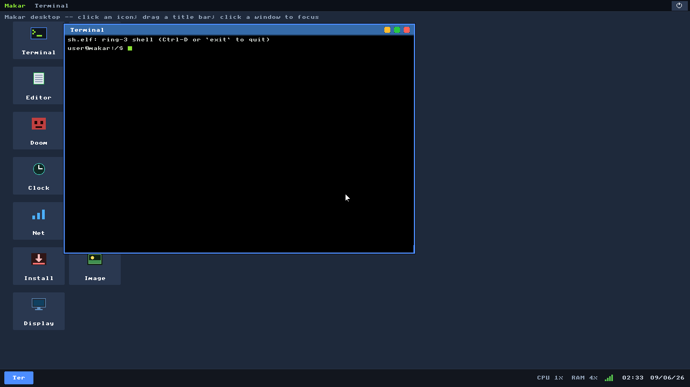
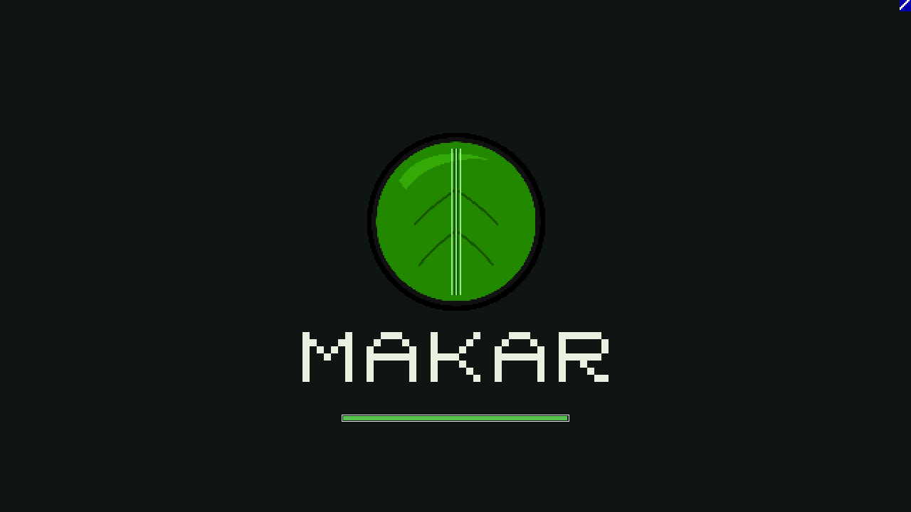
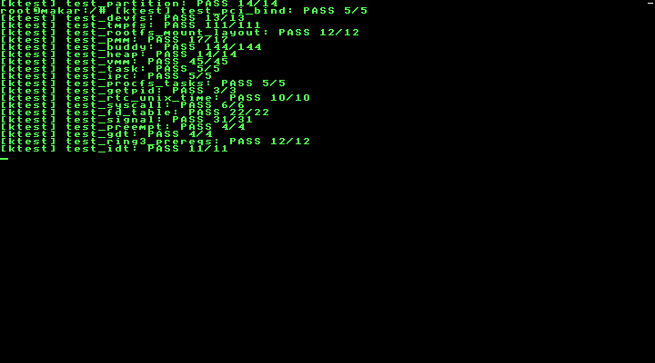
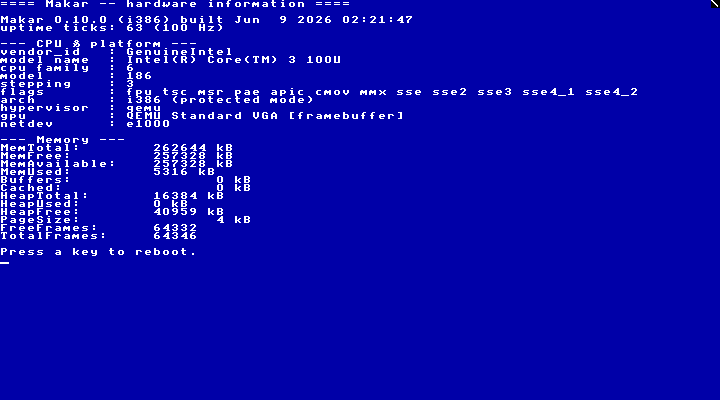

# Makar

<p align="center"></p>

[](https://github.com/Arawn-Davies/makar/actions/workflows/build-test.yml)
[](https://github.com/Arawn-Davies/makar/actions/workflows/release.yml)

Makar is a bare-metal i686 hobby OS written in C and AT&T assembly, booted by
GRUB Multiboot 2, built around a Linux i386-shaped userspace ABI, and tested in
QEMU. It is the C/GCC sibling of
[Medli](https://github.com/Arawn-Davies/Medli): the projects share OS concepts,
filesystem vocabulary, and long-term compatibility goals while using different
implementation stacks.

This README is an entry point, not the manual. Current implementation detail
lives in [`docs/`](docs/) and in the source.

Current kernel version: `0.10.5`
([`src/kernel/include/kernel/version.h`](src/kernel/include/kernel/version.h)).

## Screenshots

| | |
|---|---|
|  |  |
| **GUI desktop** — the makx window server: a terminal window, dock, launcher icons, and the bottom status tray (CPU/RAM, network, clock + date). | **GUI boot splash** — raised the instant the framebuffer settles and tracks the background self-tests; the desktop boot never shows a text console. |
|  |  |
| **Sysadmin mode** — a pure 80×50 VGA text console with the self-tests shown verbosely; type `go32` to bring up the display + network and start the desktop. | **Hardware info** — the one-shot specs screen (CPU / platform / GPU / NIC / memory), then press a key to reboot. |

These are captured headlessly by [`tools/capture-screens.sh`](tools/capture-screens.sh).

## What It Currently Is

Makar boots into a graphical VESA environment with virtual terminals, ring-3
ELF userspace, a userspace shell, a small hosted libc, an in-OS TinyCC, FAT32
and ext2 storage, copy-on-write `fork`, `execve`, `wait4`, pipes, signals,
anonymous `mmap`, i386 TLS, and x87/SSE task-state handling.

The **default boot is a graphical desktop** — the makx window server: a
mouse-driven desktop with draggable/resizable windows, a dock with a status tray
(CPU/RAM, network, clock + date), launcher icons, and a suite of `mx*` clients
(terminal, files, editor, image viewer, clock, calculator, disk, net, display
settings, installer). Other boot modes (console, verbose, sysadmin, hardware
info, rescue) live under the bootloader's **Advanced options**. A userspace
**Doom** port (`doom.elf`, vendored doomgeneric, no sound) runs windowed or
fullscreen; the FreeDOOM WADs are fetched by `getfreedoom.sh`. See
[`docs/gui.md`](docs/gui.md).

Networking is in: an in-kernel lwIP stack over a NIC-agnostic `netdev` layer with
four polled PCI drivers (virtio-net, RTL8139, Intel E1000, AMD PCNet), DHCP with a
static slirp fallback, and a small client toolset — DNS resolution, ICMP ping, an
HTTP `wget` (kernel builtin and `wget.elf`), and `unzip` (from-scratch DEFLATE).
`maknetcfg` reports/controls interface state. No TLS yet (`https://` unsupported).

For the authoritative current-state summary, read
[`docs/index.md`](docs/index.md).

## System Requirements

Makar targets 32-bit x86 and is developed and tested against QEMU
(`qemu-system-i386`, TCG by default). It should also run on real 32-bit-capable
PCs that meet the CPU/firmware needs below.

| Resource | Minimum | Notes |
|---|---|---|
| CPU | 32-bit x86, i686-class (Pentium II era or newer) | runs in protected mode; uses 4 MiB pages (`CR4.PSE`), the x87 FPU, and `FXSAVE`/SSE for per-task FP state |
| Firmware / boot | Legacy BIOS; GRUB (Multiboot 2) on the live ISO, Limine on an installed disk | the ISO is a BIOS / El-Torito hybrid image; no UEFI boot path yet |
| RAM | 64 MiB (256 MiB recommended) | `./run.sh` boots interactive with `-m 64`; read-only files stream through a page cache so DOOM + the GUI fit, but more headroom is comfortable |
| Storage (live) | ~120 MiB for `makar.iso` | the ISO ships the apps, the FreeDOOM WAD, `/usr` (libc + headers), and the full `docs/` + `src/` tree, so it's large by hobby-OS standards |
| Storage (installed) | ~256 MiB disk | a full install copies that whole tree: the release image is a 32 MiB boot partition + a 224 MiB rootfs (apps + src + docs + user data + headroom). The `./run.sh hdd` dev image defaults to a smaller 96 MiB |
| Display | VBE-capable adapter | Bochs VBE / VESA linear framebuffer (or VMware/VBox SVGA II); falls back to VGA 80×50 text |

### Supported devices / drivers

- **Display:** VMware/VBox SVGA II (accelerated, HW cursor) or VESA/VBE linear framebuffer (Bochs VBE, 720p default), VGA 80×50 text fallback
- **Storage:** IDE/ATA (PIO); filesystems ext2, FAT32, ISO9660, plus `/dev` `/proc` `/tmp` `/log` overlays
- **Input:** PS/2 keyboard + mouse (shared i8042 controller module)
- **Networking:** virtio-net / RTL8139 / e1000 / PCnet over an lwIP TCP/IP stack (DHCP + DNS)
- **Timer / clock:** PIT (250 Hz), RTC/CMOS
- **Bus / power:** PCI, ACPI (RSDP + table discovery, reboot/poweroff)
- **Serial:** 16550 UART (COM1)
- **Network (PCI):** virtio-net, RTL8139, Intel E1000, AMD PCNet — over QEMU user-mode (slirp); no TLS

## Quick Start

```sh
./run.sh iso build
./run.sh iso boot              # add a NIC for networking: iso boot e1000
./run.sh ktest
./run.sh nettest e1000         # networking suite against a chosen NIC
./run.sh kbtest
./run.sh kbtest gui
./run.sh gui all-tests
```

`./run.sh` with no arguments prints the supported command surface. The build
uses the host toolchain when available and otherwise wraps the project Docker
image.

Detailed build and test behavior:

- [`docs/building.md`](docs/building.md)
- [`docs/testing.md`](docs/testing.md)
- [`docs/wsl2.md`](docs/wsl2.md)

## Where To Read Next

| Topic | Document |
|---|---|
| Current architecture overview | [`docs/index.md`](docs/index.md) |
| Build/run/test commands | [`docs/building.md`](docs/building.md) |
| Test matrix and expected markers | [`docs/testing.md`](docs/testing.md) |
| POSIX compatibility status | [`docs/posix.md`](docs/posix.md) |
| Syscall ABI and syscall table | [`docs/syscalls.md`](docs/syscalls.md) |
| Networking, NIC drivers, wget/unzip | [`docs/networking.md`](docs/networking.md) |
| Userspace libc and static-musl bring-up | [`docs/userland-libc.md`](docs/userland-libc.md) |
| In-OS TinyCC status | [`docs/tcc.md`](docs/tcc.md) |
| Kernel internals | [`docs/internals.md`](docs/internals.md) |
| Per-subsystem reference | [`docs/kernel/`](docs/kernel/) |
| Roadmap | [`docs/roadmap.md`](docs/roadmap.md) |
| Makar and Medli | [`docs/makar-medli.md`](docs/makar-medli.md) |
| Acknowledgements and licensing notes | [`LICENSES/THANKS.md`](LICENSES/THANKS.md) |

## Repository Map

```text
src/kernel/      kernel, architecture code, drivers, filesystems, scheduler
src/libc/        freestanding kernel-side libc fragment
src/userspace/   ring-3 apps, scripts, syscall wrappers, hosted libc shim
tests/           GDB boot-test helpers
docs/            GitHub Pages documentation
LICENSES/        third-party notes, font origins, acknowledgements
toolchain/       static-musl cross-toolchain experiments
vendor/tinycc/   vendored TinyCC source
```

## Development Notes

- CI is intentionally path-filtered: Build & Test runs only for `src/**` or
  `run.sh` changes.
- In-guest tests assert on serial markers. The old host-driven keyboard/HMP
  harness is gone; use the script drivers or `kbtest`.
- Commit one discrete work item at a time.

## Licence

Original Makar source is MIT licensed; see [`LICENSE`](LICENSE). Third-party
and provenance notes are in [`LICENSES/`](LICENSES/), especially
[`LICENSES/THANKS.md`](LICENSES/THANKS.md).
