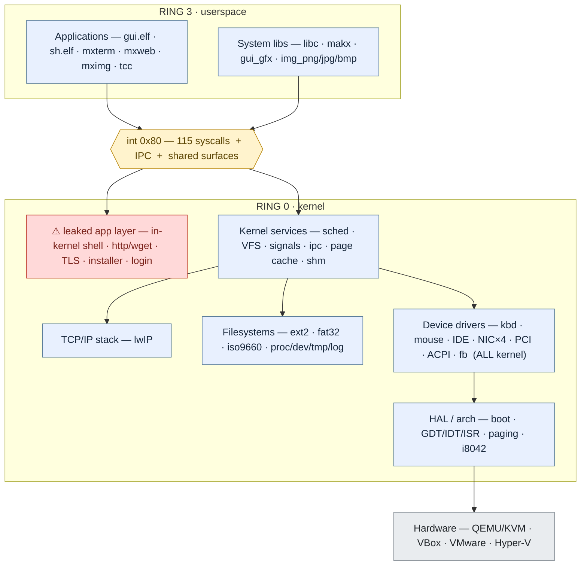
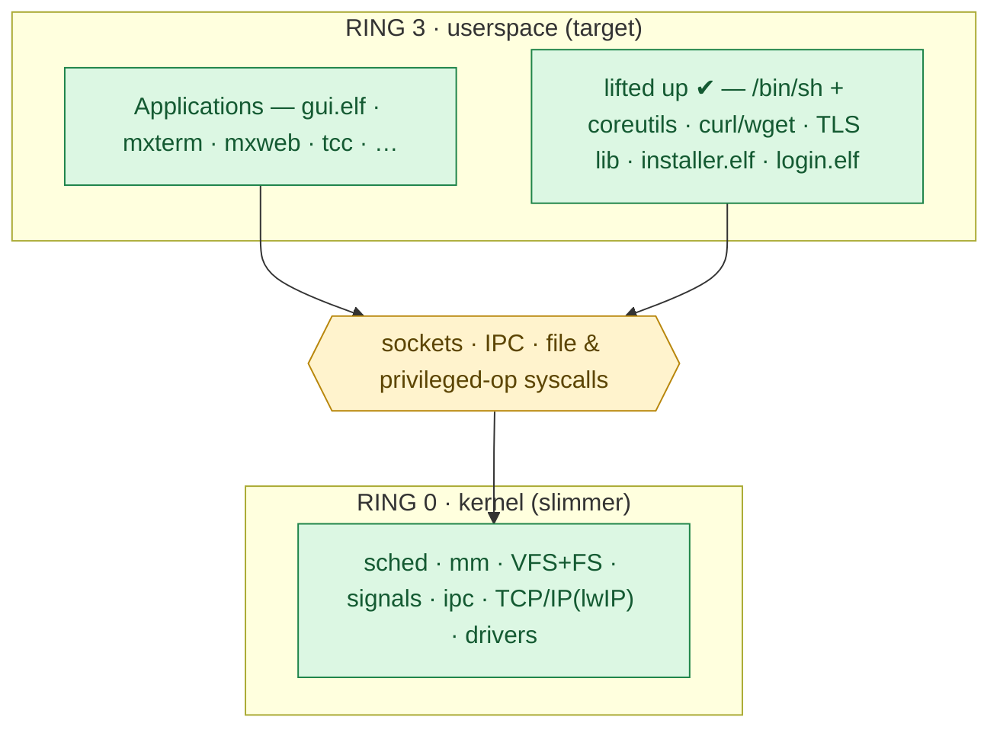

# Kernel / userspace separation audit (`krnlsepr.md`)

*Where the ring-0 / ring-3 line is drawn across the OS layer cake — which
**components** are privileged (kernel) vs unprivileged (userspace), in terms of
the driver layer and the application layer. Living doc: update as components
cross the line. (Component map first; a LOC appendix is at the end for weight.)*

## TL;DR

- **Driver layer:** the line is drawn *all the way up* — **every driver is in the
  kernel** (monolithic). There are **zero userspace drivers**. Graphics is the one
  place the split shows the modern shape: the *framebuffer driver* is kernel, but
  the *compositor* (`gui.elf`) is userspace — the Linux DRM/KMS + X model.
- **Application layer:** the line is *mostly* clean — apps are userspace — **except
  five application-grade components have leaked below the line into ring 0:** the
  in-kernel shell, the HTTP/wget client, TLS, the installer engine, and auth/login.
- **The fix** is the socket + IPC plumbing already underway (T51): give ring 3
  sockets, then lift those five back above the line where Linux keeps them.

## The layer cake and where the line cuts

```
 LAYER                         RING   COMPONENTS
════════════════════════════════════════════════════════════════════════════════
 Applications                   r3    gui.elf (WM/compositor) · sh.elf · mxterm
                                      mxweb mximg mxfiles mxedit mxcalc mxclock
                                      mxnet mxdisk mxdisplay mxinstall maktop vix
                                      cfdisk basic ar makbox statusbar tcc.elf …
    ⚠ leaked DOWN into kernel:   r0    in-kernel shell · http/wget · TLS(BearSSL)
                                      installer engine · login/auth
 ───────────────────────────────────────────────────────────────────────────────
 System libraries               r3    libc.a (hosted) · makx client · gui_gfx /
                                      gui_ui · img_png / img_jpg / img_bmp · stdio
 ═══════════════ THE DIVIDE ═════════════════════════════════════════════════════
   int 0x80  (115 syscalls)   +   IPC (proc/ipc.c)   +   shared surfaces (shm)
 ═══════════════════════════════════════════════════════════════════════════════
 Kernel services                r0    scheduler/tasking · signals · VFS · page
                                      cache · IPC · shared surfaces · TCP/IP (lwIP)
 ───────────────────────────────────────────────────────────────────────────────
 Filesystems                    r0    ext2 · fat32 · iso9660 · procfs · devfs ·
                                      tmpfs · logfs
 ───────────────────────────────────────────────────────────────────────────────
 Device drivers                 r0    keyboard · mouse · IDE/ATA disk · partition
   ── ALL in kernel ──                NIC ×4 (rtl8139/e1000/pcnet/virtio) · PCI ·
   (no userspace drivers)             ACPI · serial · timer(PIT) · RTC · USB ·
                                      framebuffer (VESA/VGA/SVGA-II)
 ───────────────────────────────────────────────────────────────────────────────
 HAL / arch (i386)              r0    boot/multiboot · GDT/IDT/ISR · paging · i8042
 ───────────────────────────────────────────────────────────────────────────────
 Hardware                       —     QEMU/KVM · VirtualBox · VMware · Hyper-V · HW
```

The line *should* sit cleanly between **System libraries (r3)** and **Kernel
services (r0)**. It does — except the application layer has dropped five boxes
through it into ring 0 (the `⚠` row).

## The same divide, as a graph (now → target)

*(Mermaid — renders in VS Code's Markdown preview with the Mermaid extension, and
natively on GitHub. The ASCII cake above is the always-works version.)*

**Now** — five red boxes sit below the line where they don't belong:



**Target** — the five lifted above the line; the kernel keeps only the privileged
core and exposes generic primitives (sockets, IPC, a few privileged-op syscalls):



## The driver-layer divide

**Everything is a kernel driver.** Makar is monolithic: keyboard, mouse, disk
(IDE/ATA), the four NICs, PCI, ACPI, serial, timer, RTC, USB, and the framebuffer
all run in ring 0 and touch hardware directly (port I/O, MMIO, DMA, IRQ handlers).
This matches Linux — on a Linux box the drivers are in-kernel too.

What it is **not** (yet) is a microkernel: there is no userspace driver server, no
`/dev`-fd-driven userspace block or net driver. The one component that looks like
the modern split is **graphics**, and it's instructive:

| Graphics concern | Ring | Component | Linux analogue |
|---|---|---|---|
| Mode-set, framebuffer, blit, HW cursor | r0 | `display/` (VESA/VGA/SVGA-II) | DRM/KMS, fbdev |
| Window management + compositing | r3 | `gui.elf` (`wm.c`) | X.Org / Wayland compositor |
| Drawing / widgets | r3 | `gui_gfx`, `gui_ui`, `makx` client | client toolkits |

That driver-in-kernel / policy-in-userspace shape is the target for the rest of
the stack too — but for *non-graphics* drivers it only happens under the
microkernel horizon (last section). Under the Linux baseline this audit measures
against, **drivers stay in ring 0** and are correctly placed there.

## The application-layer divide

Applications are userspace — `gui.elf`, `sh.elf`, the ~40 `mx*`/TUI apps, the `tcc`
compiler, the image decoders — **except five components that are application-grade
in behaviour but live in the kernel.** These are the answer to "too much in
kernelspace":

| Component | Lives in | What it actually is | Linux runs it as | Status |
|---|---|---|---|---|
| **In-kernel shell + command set** | `shell/` (ring 0) | a shell + coreutils (fs/disk/net/system/man cmds) | `/bin/bash` + coreutils | ⚠ move → user (`sh.elf` already exists in r3) |
| **HTTP / wget client** | `shell/shell_cmd_net.c` (ring 0) | an HTTP fetcher (GET + redirects) | `curl` / `wget` programs | 🔄 moving (T51) |
| **TLS / crypto (BearSSL)** | `vendor/bearssl`, linked into `makar.kernel` | a TLS library | `libssl` linked into the app | 🔄 moving (T51) — currently linked but **inert** (handshake disabled) |
| **Disk-installer engine** | `proc/installer.c` (ring 0) | an OS installer | `debian-installer` / `calamares` | ⚠ move → user (GUI front-end `mxinstall.elf` is *already* r3) |
| **Auth / login / shadow** | `auth/` (ring 0) | `login`, password check vs `/etc/shadow` | `login` / `getty` / PAM | ⚠ move → user |

Why they ended up in ring 0: each was the *quickest* place to put it (the kernel
already had disk access, the lwIP socket, the VGA console), and ring 3 was missing
the primitive it needed — chiefly **sockets** (for http/tls) and a way to run a
privileged-but-scriptable **program** (for the shell/installer). Supply the
primitive and the box lifts back above the line.

## Migration backlog (lift these above the line)

Ordered by clarity × what it unblocks. The first two are the active T51 slice; the
socket syscalls they add are the lever for the rest.

1. **TLS → r3** *(active, green-lit).* Add kernel TCP-socket syscalls
   (`socket`/`connect`/`send`/`recv`/`close` + DNS resolve), build BearSSL into
   userspace, handshake in mxweb (32 KB stack; a fault just kills the tab), then
   **strip `libbearssl.a` from the kernel image.** Unblocks HTTPS + SSH.
2. **HTTP/wget → r3.** With sockets present, the GET/redirect logic becomes a
   userspace fetch lib; the kernel keeps only the lwIP stack + the socket syscalls.
3. **Shell command-set → `sh.elf` / `/bin/*`.** Migrate the command
   *implementations* to userspace programs, leaving a minimal kernel rescue console.
   Biggest component to move; do it command-group by command-group.
4. **Installer engine → `installer.elf`.** Invert today's split: engine logic runs
   in r3 driving the UI directly; only privileged ops (write MBR, `mkfs`) stay as
   syscalls. The front-end is already where it belongs.
5. **Auth/login → `login.elf`.** A userspace program authenticates against
   `/etc/shadow`; the kernel keeps only credential/uid state. Retires the
   `SYS_LOGIN`/`SYS_PASSWD` policy from the kernel.
6. **DNS → r3** *(minor).* Expose a UDP socket; resolve in a userspace resolver.
   Low priority while lwIP's bundled resolver is cheap.

## What moves, what stays (per leaked component)

The pattern is always the same: the *policy/logic* moves up; the kernel keeps only
the **privileged primitive** the logic calls down to. Nothing here removes a
capability — it relocates where the code runs.

| Component | Moves to ring 3 | Kernel keeps (privileged) | New/again primitive | Net ABI change |
|---|---|---|---|---|
| **TLS (BearSSL)** | the whole library + handshake | nothing crypto-specific | TCP sockets | + `socket/connect/send/recv/close`; later **– `wget` once HTTP moves** |
| **HTTP/wget** | URL parse · request build · redirect follow · save-to-file | lwIP TCP/IP stack only | same sockets (reused) | none beyond sockets |
| **Shell + cmd-set** | command implementations → `/bin/*` programs | a minimal rescue line-reader for early/panic boot | (the fs/disk/admin syscalls already exist) | – the `vt_*`/`shell_*` policy calls thin out |
| **Installer engine** | the stepped engine logic → `installer.elf` | raw block write · `mkfs` · partition write | already have `SYS_MKFS`, block-dev fds | invert `SYS_INSTALL_EXEC` → plain ops; drop the engine bridge |
| **Auth/login** | `/etc/shadow` read + password verify → `login.elf` | uid/credential state · set-credentials gate | one small "set session credential" syscall | – `SYS_LOGIN`/`SYS_PASSWD` policy retired |

**Definition of done for the migration:** `makar.kernel` no longer links
`libbearssl.a`; `shell_cmd_net.c`'s HTTP/TLS is gone; the shell command-set ships as
`/bin/*`; `installer.c` is a thin privileged-op shim; `auth/` is credential state
only. At that point the `⚠` row in the layer cake is empty and the ABI has shed its
GUI/VT/session policy down to the generic-UNIX core plus sockets, IPC and surfaces.

## Already on the right side (the pattern to copy)

| Component | Ring | Linux analogue |
|---|---|---|
| Display server / compositor (`gui.elf`/`wm.c`) | r3 | X.Org / Wayland |
| Shell (`sh.elf`) | r3 | bash |
| C compiler (`tcc.elf`) | r3 | gcc/clang |
| Image decoders (`img_png/jpg/bmp`) | r3 | libpng / libjpeg in the app |
| ~40 GUI/TUI apps | r3 | userspace programs |

## The divide itself: what the 115 syscalls actually are

The boundary is `int 0x80` with **115 `SYS_*` numbers**. Bucketing them is the same
audit from the boundary instead of the components — and it tells the same story:
only about a third are generic UNIX primitives; the rest is Makar-specific
**GUI / terminal / display / admin policy** that exists *because* application-grade
code lives in the kernel and needs a kernel-side hook.

| Bucket | ~count | Examples | Verdict |
|---|--:|---|---|
| **Generic UNIX** (process · file · mem · signal · time) | ~40 | `read` `write` `open` `close` `fork` `execve` `mmap2` `pipe` `dup2` `wait4` `kill` `stat` `fcntl` `clock_gettime` | ✅ keep — the real ABI |
| Makar fs / disk / admin (privileged ops + POSIX dups) | ~24 | `mount` `umount` `mkfs` `statfs` `reboot` `shutdown` `write_file` `delete_file` `install_exec` `pci_info` | ◑ thin to privileged-op helpers; some duplicate POSIX |
| **GUI / framebuffer / surfaces** | ~24 | `fb_present` `fb_present_rect` `draw_line` `surface_*` `mouse_read` `hwcursor_*` `video_caps` `caret_style` | ⚠ policy — belongs behind a userspace display server |
| **Terminal / VT / session policy** | ~20 | `vt_enter` `vt_open_app` `vt_setname` `statusbar` `pty_winsize` `keyboard_raw` `shell_ready` `login` `passwd` | ⚠ policy — should follow the shell/login out of ring 0 |
| IPC | 4 | `ipc_send` `ipc_recv` `ipc_sendrec` `ipc_nbrecv` | ✅ keep — the enabler |
| Net | 3 | `net_info` `net_ctl` `wget` | 🔄 `wget` retires once HTTP is a userspace program over sockets |

So **~35% generic UNIX, ~65% Makar policy.** A monolithic Linux puts almost
nothing GUI/VT-shaped in its syscall table — that surface lives in userspace
servers (X/Wayland) and libraries. Shrinking Makar's ABI toward the generic core
is the *boundary-side* of the same migration: as the in-kernel shell, installer,
login and display policy move to ring 3, the ~44 GUI+VT entries thin out with them.
(Counts are approximate — bucketing a few calls is a judgement call — but the
two-thirds-is-policy shape is robust.)

## Beyond Linux: the microkernel / hybrid horizon

This audit's "correctly placed" verdicts use the **monolithic-Linux** baseline:
drivers, filesystems and the TCP/IP stack *stay* in ring 0. The longer-term
direction is a **hybrid (NT/XNU-style)** kernel, under which even those become
userspace **servers** over IPC — and the groundwork is already in ring 0:
`proc/ipc.c` (synchronous message passing) plus the shared-surface primitive are
exactly the channels a driver/FS server would use. That horizon moves the driver
line down further than this backlog does; it does not change the near-term answer,
which is just: **lift the five leaked application-layer components back above the
divide, starting with sockets/TLS.**

---

## Appendix — weight (LOC), for reference only

LOC is a proxy for "behaviour resident at this privilege level," not the point of
this audit (the component placement above is). On branch `feat/mxweb`:

- **Ring 0:** ~38.5k own (.c/.S) **+ ~24k vendored lwIP + BearSSL (294 files)
  compiled in** ≈ ~62k LOC of behaviour in the kernel image.
- **Ring 3:** ~18.6k own (.c).

Leaked-into-kernel components by size: in-kernel shell ~5.1k · installer 1.7k ·
auth 0.9k · http/wget 0.6k · BearSSL 294 files (inert). The ratio is inverted from
a Linux system, where the kernel is the smaller privileged core and the programs
are the bulk — which is the same conclusion the component map reaches.
