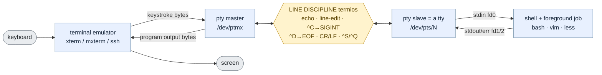
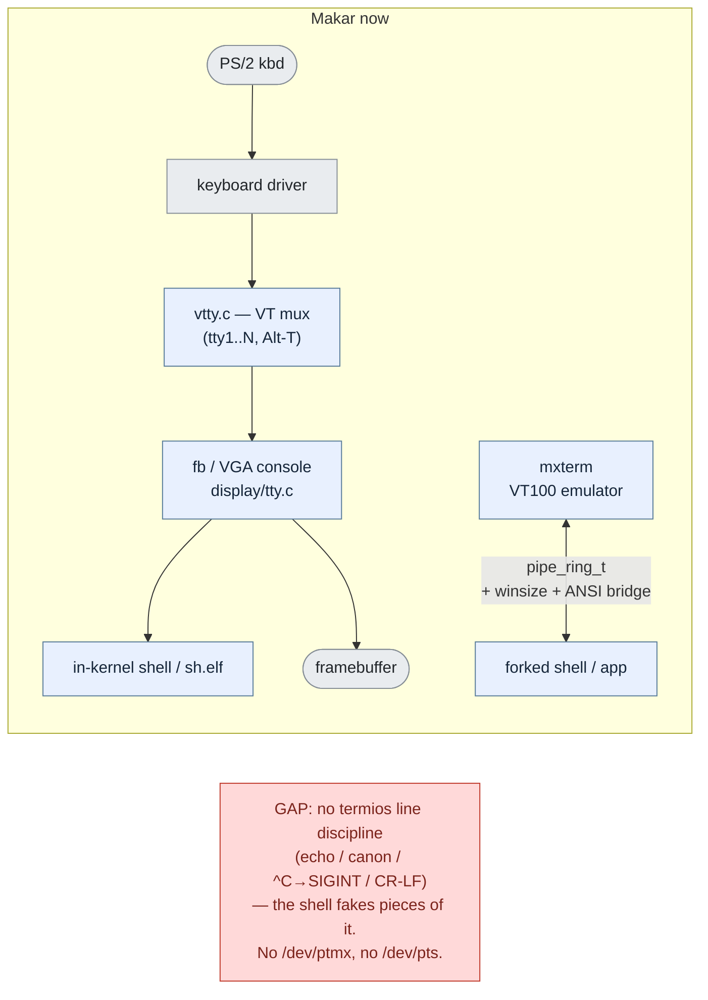
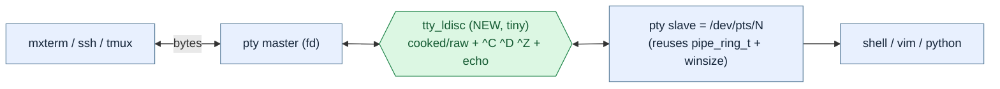

# Terminals, TTYs, PTYs — the nomenclature, and where Makar sits

*The words are a 50-year pile-up of teletype history. This untangles **shell vs
terminal vs tty vs VT/vtty vs pty (pseudo-tty / pseudo-terminal) vs pts**, answers
"is `/dev/pts` a Linux thing," shows how a real pty differs from what Makar has
today, and sketches the smallest pty Makar could grow.*

## The one-paragraph version

A **shell** is just a program that reads commands. A **terminal** is the thing
that shows text and takes keystrokes — once a physical device, now a **terminal
emulator** program. A **tty** is the *kernel device* that sits between them and
carries the line (with a **line discipline**: echo, line-editing, `^C`→signal). A
**VT** is one of several text ttys the kernel paints on the one real screen. A
**pty** is a *software* tty: a **master/slave pair** that lets a terminal-emulator
program (or `ssh`, `tmux`) pretend to be hardware for a shell. **pts** is just the
name of the slave side (and, on Linux, the filesystem the slaves live in). They
are layers, not synonyms — except "pseudo-tty" and "pseudo-terminal" which *are*
the same thing (pty).

## Glossary (least to most confusing)

| Term | What it actually is | Makar today |
|---|---|---|
| **Shell** | A program (`bash`, `sh`) that reads commands and spawns processes. Its stdin/stdout merely *happen* to be a terminal. Not itself a terminal. | in-kernel `shell.c` + ring-3 `sh.elf` |
| **Terminal** / **terminal emulator** | The front-end: draws a character grid, turns keystrokes into bytes and bytes into glyphs. Was a VT100; now `xterm`/`mxterm`. | `mxterm` (VT100/ANSI), the fb console |
| **tty** | "teletype." The **kernel character device** for a terminal line (`/dev/tty`, `/dev/console`), carrying a **line discipline** (termios). The interface a program opens to "talk to its terminal." | the fb/VGA console (`display/tty.c`) — no termios |
| **VT** / **virtual terminal** (often "vtty") | Several independent text ttys the kernel time-shares on one physical screen + keyboard (Linux `tty1..N`, Ctrl-Alt-F1..). | `proc/vtty.c` + `SYS_VT_*` + `makmux` |
| **pty** = **pseudo-tty** = **pseudo-terminal** | A tty implemented *purely in software* as a **master↔slave pair**. The **slave** behaves exactly like a real tty (line discipline and all); the **master** is the byte pipe a terminal emulator / `ssh` / `tmux` drives. Same thing, three names. | a `pipe_ring_t` pair — *without* a line discipline |
| **ptm / ptmx** | The **master** end. `/dev/ptmx` is the "clone" device: open it and the kernel hands back a fresh master + allocates a slave. | — (no ptmx) |
| **pts** | The **slave** end. On Linux the slaves live in the **`devpts`** filesystem at `/dev/pts/N`. | — (no `/dev/pts`) |
| **Line discipline** | The kernel layer *inside* a tty/pty that does echo, canonical line-editing (backspace before the program sees the line), `^C`→`SIGINT` / `^Z`→`SIGTSTP` / `^D`→EOF, `^S`/`^Q` flow control, and CR↔LF translation. Configured via **termios**. | **not present** — the shell fakes parts of it |

## How a real pty is wired (the canonical UNIX flow)

The crux: the **slave is indistinguishable from a hardware tty** to the shell — it
has the line discipline — while the **master is just bytes** for whoever is
emulating the terminal. That single trick is what lets `ssh`, `tmux`, `screen`,
`script`, and every GUI terminal exist.

## "Is `/dev/pts` a Linux thing, or common across *nixes?"

**The `/dev/pts` *path* is mostly Linux. The *API* underneath is POSIX and
portable. BSD and macOS name the slaves differently.**

| System | Master | Slave naming | Slave namespace |
|---|---|---|---|
| **Linux** | `/dev/ptmx` | `/dev/pts/N` | **`devpts`** filesystem mounted at `/dev/pts` |
| **POSIX / UNIX98** (the standard) | `posix_openpt()` → `/dev/ptmx` | `ptsname()` returns the path | unspecified — use the API, not the path |
| **FreeBSD** (modern) | `/dev/ptmx` | `/dev/pts/N` | pts (UNIX98-style); legacy BSD ptys removed |
| **Old BSD** ("BSD ptys") | `/dev/pty[p-za-e][0-9a-f]` | `/dev/tty[p-za-e][0-9a-f]` | static pre-made device pairs, no filesystem |
| **macOS / Darwin** | `/dev/ptmx` | `/dev/ttys###` | **cloning device, no `/dev/pts` mount** |
| **illumos / Solaris** | `/dev/ptmx` | `/dev/pts/N` | STREAMS pty + a pts namespace |

So: **don't hard-code `/dev/pts/N`** — that's Linux/Solaris-shaped. Portable code
calls `posix_openpt`/`grantpt`/`unlockpt`/`ptsname` (or `openpty`/`forkpty` from
libutil), and the kernel hands back whatever the slave path is. The *concept*
(master clone + named slave) is universal; the *spelling* is per-OS.

## What Makar has today

Two separate stacks, neither a real pty:

1. **Virtual terminals (the VT/vtty path)** — `proc/vtty.c` multiplexes several
   text consoles on the one framebuffer + PS/2 keyboard (`SYS_VT_*`: `vt_enter`,
   `vt_open_request` on Alt-T, `vt_state`, names in the status bar; `makmux`
   drives the tabs). This is Makar's `/dev/tty1..N`. Each VT *is* the terminal —
   there's no emulator process, the kernel paints glyphs directly.

2. **The GUI-terminal path (a pipe pretending to be a pty)** — `mxterm` is a real
   VT100/ANSI emulator in a makx window. It `fork`s a shell/app whose `stdin`/
   `stdout` are the two ends of a **`pipe_ring_t`** (`kernel/fd.h`): a 4 KiB ring
   with `cols`/`rows` set via **`SYS_PTY_WINSIZE`**. The kernel's **cell-API→ANSI
   bridge** (in `syscall.c`) turns a piped child's `putch_at`/`set_cursor` calls
   into ANSI escapes on that pipe, so TUI apps render in the window.

## How a real pty differs from Makar's pipe

A `pipe_ring_t` already gives the one structural thing a pty needs — a
**bidirectional byte channel** with a winsize. What's missing is everything the
*line discipline* and the *device model* add:

| Real pty has… | Makar's pipe-pty | Why it matters |
|---|---|---|
| **termios line discipline** (echo, canonical line-edit, `^C`/`^Z`/`^D`, `^S`/`^Q`, CR/LF) | done ad-hoc in `shell_readline`, only for the shell | `vim`/`less`/`python` need raw mode + signal chars; today only the shell's own reader behaves |
| **master/slave *device* pair** (`/dev/ptmx` + `/dev/pts/N`) | two anonymous pipe fds | no way to `open()` a terminal by name; `ssh`/`tmux`/`script` have nothing to attach to |
| **controlling terminal** (session leader, foreground pgrp, `SIGHUP` on close, `TIOCSCTTY`) | none | job control, Ctrl-C-to-the-right-process, "hang up on disconnect" |
| **`TIOCGWINSZ`/`TIOCSWINSZ`** ioctls | a bespoke `SYS_PTY_WINSIZE` | apps resize via the standard ioctl, not a Makar-only call |
| **`openpty`/`forkpty`/`ptsname`** | none | the portable way programs make a pty |

So Makar doesn't have "small ptys," it has **pipes wearing a terminal hat** — fine
for piping a TUI into a window, short of a real terminal for arbitrary programs.

## "Almost infinitesimal pseudo-terminals" — the minimal Makar pty

The good news: because the pipe already is the master↔slave transport, a *tiny*
pty is mostly **one new layer (a line discipline) + a thin device front**:

1. **A `tty_ldisc` shim over `pipe_ring_t`** (the 80/20): on the slave side, in
   canonical mode, buffer a line and echo it, handle backspace, turn `^C`/`^D`/
   `^Z` into `SIGINT`/EOF/`SIGTSTP` to the foreground task, and translate CR→LF.
   A `raw` flag bypasses it for `vim`/`mxedit`. This is "termios-lite" — three
   modes (cooked/raw/cbreak) and a handful of control chars, not the full struct.
2. **A pty allocator**: a `/dev/ptmx`-style call (or a `SYS_OPENPTY` that returns
   `{master_fd, slave_fd}`) that wraps a `pipe_ring_t` pair + an ldisc + winsize.
   Name slaves `/dev/pts/N` in the existing devfs overlay (Linux-shaped; cheap and
   familiar — and consistent with the "follow the Linux convention" house rule).
3. **`TIOCGWINSZ`/`TIOCSWINSZ` ioctls** mapped onto the winsize already in
   `pipe_ring_t` (retiring the bespoke `SYS_PTY_WINSIZE`).
4. *(Later)* a controlling-terminal link (session + foreground pgrp) so job
   control and `SIGHUP`-on-close work.

That converges Makar onto the UNIX picture with the least code: **VTs stay as the
kernel consoles; the pipe becomes a proper pty once it grows a line discipline and
a `/dev/pts` face.** Nothing here needs threads or STREAMS — it's a ring buffer, a
small state machine, and a device name.

## One-line answers

- **`/dev/pts`?** Linux (and Solaris) spell it that way; the `posix_openpt`/
  `ptsname` *API* is portable; BSD/macOS name the slaves differently. Use the API.
- **Shell vs terminal?** The shell is a program; the terminal is the device/UI it
  reads and writes. Swap either independently.
- **tty vs pty?** A tty is a kernel terminal device; a pty is a software tty made
  of a master/slave pair (so emulators and `ssh` can be "the hardware").
- **vtty?** Makar's multiple kernel text consoles on one screen — not a pty.
- **What Makar lacks?** A termios **line discipline** and a **`/dev/ptmx` + pts**
  device face — both small, layered on the pipe it already has.
